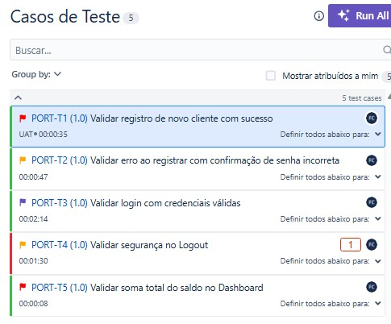
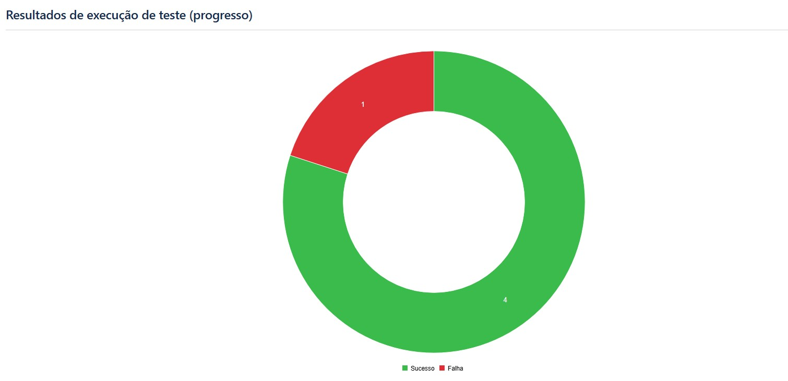
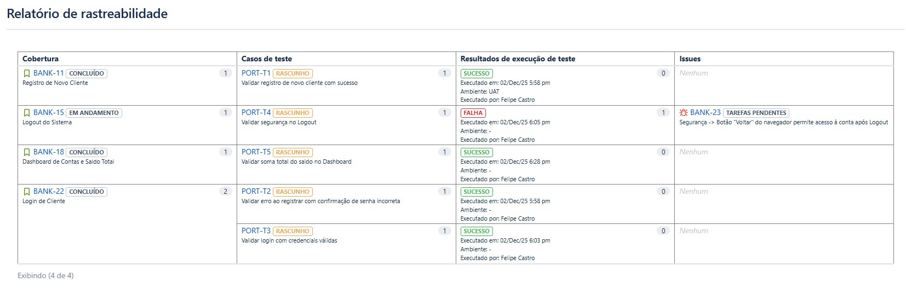

#  ParaBank QA Project | Portfólio de Testes Manuais

O sistema testado foi o ParaBank, uma aplicação bancária fictícia, com foco nos fluxos essenciais de cadastro, login e segurança de acesso.
O objetivo principal foi validar o MVP de Acesso, identificando falhas funcionais e de segurança antes da evolução do produto.
---

##  O que usei nesse projeto?
* **Jira Software:** Para organizar as Sprints e tarefas (Scrum).
* **Zephyr Scale:** Para criar, organizar e rodar os testes.
* **BDD (Gherkin):** Para escrever requisitos que todo mundo entende (Dado/Quando/Então).
* **ScreenPal & Prints:** Para provar o que encontrei.

---

##  O Ciclo da Sprint 1: MVP de Acesso

A missão dessa Sprint foi garantir que novos usuários conseguissem se cadastrar e entrar no banco com segurança. Abaixo, mostro passo a passo como conduzi o processo.

### 1. Organizando a Casa (Backlog e Jira)
Primeiro quebrei os requisitos em **User Stories** pequenas e testáveis (usando a técnica INVEST). Organizei tudo no quadro Kanban para o time saber o que estava acontecendo.

*(Visão geral do Board com as tarefas organizadas)*

---

### 2. Criando os Testes
Criei roteiros de teste (step by step).

*(Exemplo de um teste escrito passo a passo)*

---

### 3. Execução
Rodei os testes no ambiente de Staging. O resultado foi positivo na maioria, mas encontrei problemas.

* **Resultado:** 4 Passaram (✅) / 1 Falhou (❌)

*(Lista dos testes rodados e seus status)*

---

### 4. Caçando Bugs (Defeitos)
Durante os testes de segurança, encontrei uma falha crítica no Logout. Documentei tudo para o desenvolvedor não ter dúvida de como arrumar.

* **O Bug:** O botão "Voltar" do navegador mostrava a conta logada mesmo depois de sair.
* **Evidência:** Anexei vídeo e prints no ticket.

*(O ticket do bug aberto no Jira, com prioridade alta)*

---

### 5. Métricas e Relatórios Finais
Para fechar a Sprint, gerei os relatórios que mostram a saúde do projeto.

####  Resumo Visual (Donut Chart)
A maioria das funções está estável, com exceção do ponto de segurança.

####  Rastreabilidade (Traceability)
Aqui eu provo que não testei coisas aleatórias. Cada teste está ligado a um requisito de negócio.

####  Lista Detalhada
Os detalhes de cada execução:

---

##  Próximos Passos (Sprint 2)
Agora que o acesso básico está testado, o plano é:
1. Validar Transferências e Pagamentos.
2. Retestar o bug de Logout assim que corrigirem.

---
*Autor: Felipe Castro | [Meu LinkedIn](felipetster)*
